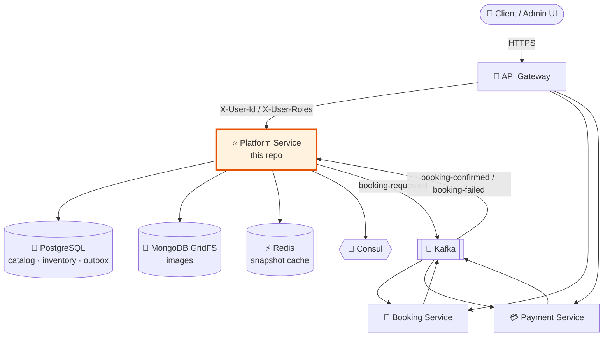

# 🌟 Moment Forever — Platform Service

> **"Preserving Your Special Moments, Forever."**

[](https://www.oracle.com/java/technologies/javase/jdk17-archive-downloads.html)
[](https://spring.io/projects/spring-boot)
[](https://www.postgresql.org/)
[](https://www.mongodb.com/)
[](https://redis.io/)
[](https://kafka.apache.org/)

---

## 📖 About

**Moment Forever** is an event decoration platform. This repository contains the
**Platform service** (`moment-forever-platform`) — the **core microservice** of
an event-driven system. It owns the catalog, media, identity and slot inventory,
and it starts the booking saga that the Booking and Payment services complete.

It is **not** the whole system. Bookings and payments live in their own services
and are reached only through Kafka events.

### What this service owns

| ✅ Owned here | ❌ Owned elsewhere |
| :--- | :--- |
| Categories, sub-categories, experiences | Booking records (Booking service) |
| Locations, time slots, add-ons | Payment processing (Payment service) |
| Slot capacity reservation & compensation | Request routing / edge auth (API Gateway) |
| Images (MongoDB GridFS) | |
| Users, roles, JWT issuance | |

---

## 🏗️ Architecture at a glance



📚 **Deep dives:**

- [`docs/ARCHITECTURE.md`](docs/ARCHITECTURE.md) — service boundaries, outbox pattern, Kafka contract, Redis keys, runbook
- [`docs/BOOKING_EVENT_FLOW.md`](docs/BOOKING_EVENT_FLOW.md) — timed end-to-end booking saga diagram
- [`SETUP.md`](SETUP.md) — IDE / local build setup

---

## ⚙️ How a booking works (short version)

1. `POST /platform/admin/bookings` → JWT identity arrives as gateway headers.
2. In **one PostgreSQL transaction**: capacity is incremented with a guarded
   `UPDATE`, and an outbox row is written. Zero rows updated ⇒ sold out ⇒ `409`.
3. `202 Accepted` returns immediately with a booking reference — the client
   never waits on Kafka.
4. An `@Async` task enriches the event from Redis (DB fallback + re-warm),
   resolves the `BASE → LOCATION → SLOT` price chain, and publishes
   `booking-requested`.
5. Booking and Payment services take over. If the saga fails,
   `BookingFailedConsumer` releases the reserved capacity.
6. A Quartz poller retries stuck records and compensates permanently failed ones.

---

## 🧩 Module structure

| Module | Purpose |
| :--- | :--- |
| `moment_forever_commons` | Shared DTOs, Kafka event contracts, snapshots, error handling |
| `moment_forever_data` | JPA entities and the DAO layer |
| `moment_forever_security` | JWT service, gateway header auth filter, Spring Security config |
| `moment_forever_object_store` | Object storage abstraction (GridFS, S3) |
| `moment_forever_core` | ⭐ The runnable Spring Boot service |

---

## 🚀 Getting started

### Prerequisites

| Dependency | Default endpoint |
| :--- | :--- |
| JDK 17 | — |
| Maven 3.8+ (or the bundled `mvnw`) | — |
| PostgreSQL | `localhost:5432` / db `moment_forever_db` |
| MongoDB | `localhost:27017` |
| Redis | `localhost:6379` |
| Kafka | `localhost:9092` |
| Consul *(optional)* | `localhost:8500` |

> There is no `docker-compose.yml` in this repository. Start the backing
> services yourself, or point the service at existing ones using the environment
> variables below.

### Build and run

```powershell
mvn clean install
mvn spring-boot:run -pl moment_forever_core
```

> ℹ️ The repository contains `.mvn/wrapper/maven-wrapper.properties` but **not**
> the `mvnw` / `mvnw.cmd` launcher scripts, so `.\mvnw` does not work — use a
> locally installed Maven 3.8+ as shown above, or regenerate the wrapper with
> `mvn wrapper:wrapper`.

The service starts on **http://localhost:8081/platform**.

### Environment variables

| Variable | Default | Purpose |
| :--- | :--- | :--- |
| `POSTGRES_HOST` | `localhost` | Catalog / inventory / outbox database |
| `MONGO_HOST` | `localhost` | GridFS image storage |
| `REDIS_HOST` | `localhost` | Snapshot cache |
| `SPRING_KAFKA_BOOTSTRAP_SERVERS` | `localhost:9092` | Kafka brokers |
| `CONSUL_HOST` | `localhost` | Service discovery |

> ⚠️ `application.yml` contains development-only defaults — a plaintext
> datasource password and a placeholder `jwt.secret`. Override both before
> deploying anywhere that is not your laptop.

### First run

`SuperAdminSeeder` creates a default `SUPER_ADMIN` account on startup if one does
not already exist. Change its credentials immediately outside local development.

---

## 📚 API documentation

Swagger UI: **http://localhost:8081/platform/swagger-ui.html**

| Group | Base path | Description |
| :--- | :--- | :--- |
| **Public** | `/public/**` | Catalog browsing, image serving |
| **User** | `/user/**` | Profile management (authenticated) |
| **Admin** | `/admin/**` | Experience, slot, add-on, media and booking management |

Health: `GET /platform/actuator/health`

---

## 🩺 Operations quick reference

| Symptom | First thing to check |
| :--- | :--- |
| `202` returned but booking never confirms | Outbox rows stuck in `FAILED` |
| Slow enrichment | Cold Redis snapshot cache |
| Capacity looks wrong | Outbox rows in `DEAD`; grep logs for `ALERT:` |
| Messages in `core-dlt` | Consumer handler throwing exceptions |

Full runbook in [`docs/ARCHITECTURE.md`](docs/ARCHITECTURE.md#9-operational-runbook).

---

## 🤝 Contribution

1. Fork the repository
2. Create your feature branch (`git checkout -b feature/AmazingFeature`)
3. Commit your changes (`git commit -m 'Add some AmazingFeature'`)
4. Push to the branch (`git push origin feature/AmazingFeature`)
5. Open a Pull Request

---
*Built with ❤️ by the Moment Forever Team*
