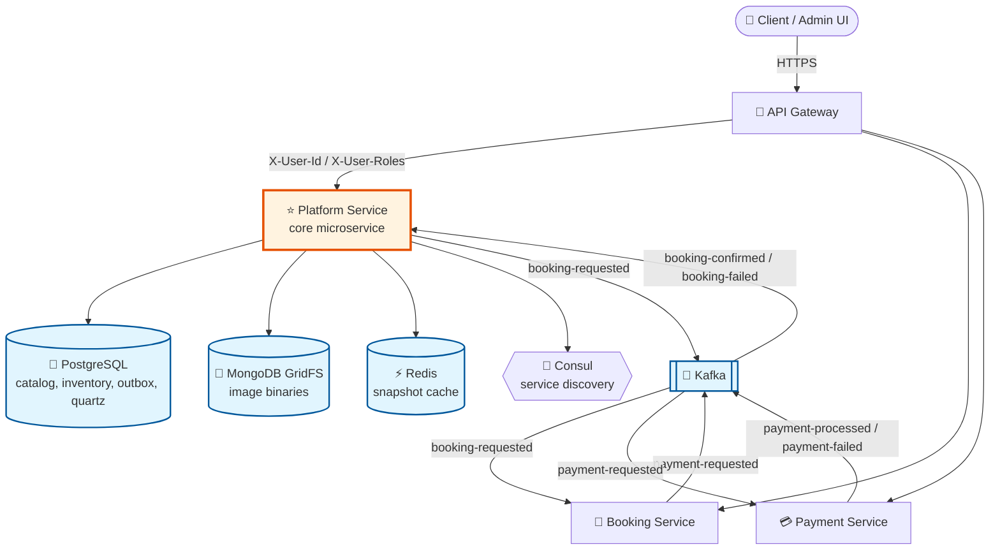
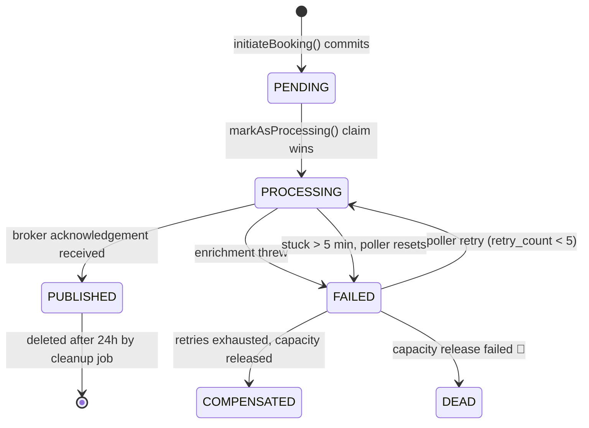
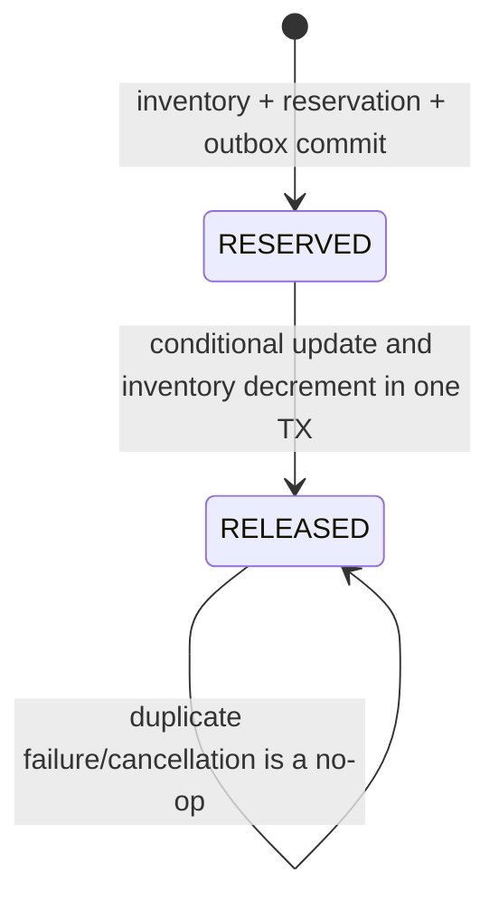

# 🏗️ Platform (Core) Microservice — Architecture

> **Service name:** `moment-forever-platform`
> **Context path:** `/platform` · **Port:** `8081`
> **Role:** Core microservice — catalog, identity, media, inventory and the
> booking *initiation* half of the booking saga.

Related documents:

- [BOOKING_EVENT_FLOW.md](./BOOKING_EVENT_FLOW.md) — the timed end-to-end booking saga
- [BOOKING_RELIABILITY_CASE_STUDY.md](./BOOKING_RELIABILITY_CASE_STUDY.md) — design lessons, failures and fixes
- [BOOKING_RELIABILITY_ORGANIZATION.md](./BOOKING_RELIABILITY_ORGANIZATION.md) — reliability package map and naming boundaries
- [HTTP_REQUEST_IDEMPOTENCY.md](./HTTP_REQUEST_IDEMPOTENCY.md) — booking request retry contract
- [CONSUMER_EVENT_IDEMPOTENCY.md](./CONSUMER_EVENT_IDEMPOTENCY.md) — incoming event deduplication
- [../SETUP.md](../SETUP.md) — local environment setup
- [../README.md](../README.md) — project overview

---

## 1. Where Platform sits

Platform is one of three business microservices behind an API gateway. It owns
the **catalog and inventory**; it does not own bookings or payments.



### Ownership boundaries

| Concern | Owner | Notes |
| :--- | :--- | :--- |
| Categories, experiences, locations, time slots, add-ons | **Platform** | Source of truth |
| Date-scoped slot inventory | **Platform** | `max_capacity` is configured on the slot mapper; `booked_count` is stored per mapper and booking date |
| Image binaries and metadata | **Platform** | MongoDB GridFS |
| Users, roles, JWT issuance | **Platform** (`security` module) | Gateway forwards identity headers |
| Booking records and lifecycle | Booking service | Platform owns only the capacity reservation identified by `bookingId` |
| Payments | Payment service | Platform never sees payment data |

---

## 2. Polyglot persistence

Each store is chosen for one job — this is deliberate, not incidental:

| Store | Used for | Why |
| :--- | :--- | :--- |
| **PostgreSQL** | Catalog, inventory, booking reservations, HTTP request claims, outgoing outbox, incoming event inbox, Quartz job store | Needs ACID transactions around each reliability boundary |
| **MongoDB GridFS** | Image binaries and chunks | Large blobs don't belong in a relational row; GridFS chunks and streams them |
| **Redis** | Catalog snapshots (`exp:`, `slot:`, `addon:`, `user:`) | Enrichment must not hammer Postgres on every booking; snapshots are read-mostly |
| **Kafka** | Inter-service events | Durable, ordered-per-key, replayable |

Redis is a **cache, never a source of truth**. Every read path in
`BookingEnrichmentTask` falls back to Postgres on a miss and re-warms the key, so
flushing Redis costs latency, not correctness.

---

## 3. Module layout

The service is a Maven multi-module build; `moment_forever_core` is the
deployable Spring Boot application, the rest are libraries.

```
MomentForeverApp (pom)
├── moment_forever_commons       DTOs, event contracts, snapshots, error handling
├── moment_forever_data          Entities + DAO layer (JPA/Hibernate)
├── moment_forever_security      JWT, gateway header auth, Spring Security config
├── moment_forever_object_store  GridFS / S3 object storage abstraction
└── moment_forever_core          ⭐ Runnable service: controllers, services,
                                   Kafka producer/consumers, Quartz jobs
```

### `moment_forever_core` package map

| Package | Contents |
| :--- | :--- |
| `core.controller.pub` | Unauthenticated browse endpoints (catalog, images) |
| `core.controller.user` | Authenticated user endpoints (profile) |
| `core.controller.admin` | Admin CRUD (experiences, slots, add-ons, media, bookings) |
| `core.services` | Booking orchestration and transaction/retry services plus catalog business logic |
| `core.idempotency.request` | HTTP request fingerprinting, claim/replay coordination, and stable initiation result |
| `core.idempotency.event` | `booking-failed` consumer and producer-scoped inbox processor |
| `core.retries` | Outbox state transitions plus scheduled recovery, compensation, and retention |
| `core.event_enrichment` | `BookingEnrichmentTask` and snapshot/pricing/event builders |
| `core.producer` | `BookingEventProducer` — Kafka publish |
| `core.scheduler` | Quartz `Job` shells for retry and cleanup |
| `core.config` | Kafka, Redis, Quartz, thread pool, Swagger, image URL config |
| `core.mapper` | Entity ↔ DTO bean mappers |
| `core.seeder` | `SuperAdminSeeder` — bootstraps the initial SUPER_ADMIN |

---

## 4. Authentication model

Platform does **not** re-validate end-user credentials on internal calls. The API
gateway authenticates the JWT and forwards identity as headers, which
`GatewayHeaderAuthenticationFilter` (in `moment_forever_security`) turns back
into a Spring Security principal:

```
X-User-Id     → application user id
X-User-Roles  → comma-separated roles
```

Controllers such as `BookingControllerAdmin` bind `X-User-Id` directly, which is
why `initiateBooking` takes an explicit `userId` rather than reading
`SecurityContextHolder`.

> ⚠️ **Consequence:** these headers must never be accepted from outside the
> trust boundary. The gateway is responsible for stripping client-supplied
> `X-User-*` headers.

---

## 5. The transactional outbox

The single most important invariant in this service:

> **Inventory, the booking-level reservation, and the intent to publish are
> written in one PostgreSQL transaction.** Kafka is never contacted inside that
> transaction.



`BookingOutbox` describes Platform's attempt to publish `booking-requested`; it
does not describe the Booking service's lifecycle. `BookingReservation` separately
describes whether this booking still owns capacity:



Here `RESERVED` means "capacity is still held", including after the Booking service
confirms the booking. It is not equivalent to a pending booking status.

### Why each mechanism exists

| Mechanism | Problem it solves |
| :--- | :--- |
| Unique inventory row + optimistic version | Concurrent first inserts are retried; concurrent updates cannot overwrite each other |
| `BookingReservation` (`RESERVED` → `RELEASED`) | One booking can release its inventory at most once, including Kafka redelivery and concurrent consumers |
| Outbox row in the same TX | Dual-write problem — DB committed but Kafka publish lost |
| `markAsProcessing` conditional claim | Two workers (async task + poller, or two pods) publishing the same event twice |
| `processing_started_at` + stuck reset after 5 min | Detects pod crashes from claim time, increments the abandoned attempt, and retries after reset commits |
| `retry_count` cap + compensation | A permanently poisoned record silently holding inventory forever |
| `DEAD` status + alert | Compensation itself failing — needs a human, must not be swallowed |
| Date-scoped inventory release | Compensation affects only the original slot mapper and booking date |

### Scheduling

Quartz runs with a **JDBC job store in clustered mode**, so multiple Platform
instances share one schedule instead of each running the poller independently.

| Job | Interval | Action |
| :--- | :--- | :--- |
| `OutboxRetriesJob` | 1 min | Reset stuck rows, retry unresolved, compensate exhausted |
| `OutboxCleanupJob` | 24 h | Delete `PUBLISHED` outbox rows older than 24 h and completed HTTP idempotency rows older than 30 days |

Both triggers use `withMisfireHandlingInstructionFireNow()` — after downtime the
job fires once immediately rather than replaying every missed fire, because a
single pass already drains the entire backlog.

---

## 6. Kafka contract

Topic names are indirected through configuration so environments can prefix them.

| Logical topic | Config key | Direction | Payload |
| :--- | :--- | :--- | :--- |
| `topic_booking_requested` | `kafka.topics.booking-requested` | **Produced** | `BookingRequestEvent` (fully enriched) |
| `topic_booking_confirmed` | `kafka.topics.booking-confirmed` | Declared, but no Platform consumer exists | `BookingConfirmedEvent` |
| `topic_booking_failed` | `kafka.topics.booking-failed` | **Consumed** | `BookingFailedEvent` → inventory compensation |
| `<original-topic>.DLT` | Spring Kafka default | Actual dead-letter destination after retries |
| `core-dlt` | — | Declared topic, currently not wired to the recoverer |

**Delivery semantics**

- Producer: `acks=all`, `retries=3`; the outbox is marked `PUBLISHED` only after
  the Kafka future succeeds. The current one-replica topic is still a
  development-only durability setting.
- Message key: `bookingId`. All events for one booking land on the same
  partition, guaranteeing per-booking ordering.
- Consumer: `enable.auto.commit=false` with `MANUAL_IMMEDIATE` ack. Handlers ack
  only after successful processing; failures are retried 3× with 1 s fixed
  backoff, then dead-lettered.
- Events are **enriched, not thin**. `BookingRequestEvent` carries name/price
  snapshots so the Booking service never has to call back into Platform.

Identity-bearing `BookingFailedEvent` deliveries are deduplicated by
`UNIQUE(producer, event_id)` in `consumer_event_inbox`. Legacy payloads with both
identity fields absent retain the reservation-only path; partially populated
identity is rejected. `BookingReservation RESERVED -> RELEASED` remains the
separate business invariant, so even distinct legitimate event IDs can release a
booking's capacity only once.

---

## 7. Cross-service reliability status

The following is the verified state as of the latest Platform and Booking code
review. Payment behavior is architectural intent only until that repository is
audited.

### Guarantees implemented in Platform

- Inventory is scoped by `(slot_mapper_id, booking_date)`.
- Existing inventory updates use optimistic locking; concurrent first inserts use
  a unique constraint and bounded retry in a new transaction.
- Inventory, `BookingReservation(RESERVED)`, and `BookingOutbox(PENDING)` are
  created in one transaction.
- Booking creation requires a caller-scoped `Idempotency-Key`; exact HTTP retries
  replay the stored response without another reservation or event.
- Producer-scoped incoming event identities are claimed in
  `consumer_event_inbox` in the same transaction as compensation.
- A failure conditionally changes `BookingReservation` from `RESERVED` to
  `RELEASED` and decrements inventory in the same transaction.
- Duplicate/concurrent `booking-failed` deliveries cannot decrement inventory
  twice.
- Kafka failure is recorded as `FAILED`; `PUBLISHED` is written only after broker
  acknowledgement.
- Stuck outbox attempts use `processing_started_at`, consume a retry, and are
  dispatched after the scheduler transaction commits.

### Open Platform gaps

| Priority | Gap | Consequence | Required direction |
| :--- | :--- | :--- | :--- |
| P0 | Outbox terminal transitions are not guarded by attempt/claim token | A worker considered stuck can later mark a compensated row `PUBLISHED`, publishing after capacity was released | Add lease owner/attempt token and conditional `PROCESSING -> PUBLISHED/FAILED`; compensate only a claimed failed row |
| P0 | Reservation migration infers active state only from Platform outbox status | Historical `PUBLISHED` rows may already be confirmed or failed; backfill cannot safely infer the current capacity owner | Reconcile migration data with Booking before enabling compensation |
| P1 | Compensation catches a failure from a joined transactional service | The transaction may already be rollback-only, so the attempted `DEAD` status may not commit | Isolate each compensation in its own worker transaction and classify retryable vs terminal failures |
| P1 | `BookingRequestEvent` has no immutable `eventId` or schema version | General consumer deduplication and contract evolution are harder | Extend the common event envelope and persist the generated ID in the outbox |
| P1 | Booking and Platform use drifted event classes; missing inbound IDs can be generated on the consumer | A consumer-generated UUID looks valid but cannot identify a retransmission | Generate identity only at the producer, require it on deserialize, and share/version schemas |
| P1 | Kafka publish waits with unbounded `join()` and executor queue is only 100 | Broker degradation can exhaust all enrichment workers and defer work to the scheduler | Configure delivery timeout, bounded waiting, queue metrics and capacity |
| P1 | Default DLT resolver is used while `core-dlt` is separately declared | Failed records normally target `<original-topic>.DLT`, not the documented `core-dlt` | Configure an explicit destination resolver and provision/monitor that topic |
| P1 | Schema evolution relies on `ddl-auto:update` plus manually run SQL | Deployments can start with code and schema at different versions | Adopt Flyway/Liquibase and make migrations part of deployment |
| P2 | Cleanup deletes only `PUBLISHED` outbox rows | `COMPENSATED` and `DEAD` terminal rows grow indefinitely | Define retention/archive policy per terminal state |
| P2 | Topics use one partition and one replica | Throughput and fault tolerance are development scale | Size partitions/replication and preserve booking-key ordering |
| P2 | Concurrency behavior is covered only by mocked unit tests | Real PostgreSQL update/locking semantics are not continuously proven | Add database integration tests for first insert, optimistic conflict and duplicate release |

### Verified Booking-service gaps

The coordinated Booking review found:

| Priority | Gap | Consequence |
| :--- | :--- | :--- |
| P0 | `PAYMENT_REQUESTED` outbox rows are routed under the wrong event-type case | A payment event can be skipped while the row is marked `SENT` |
| P0 | Payment-failure processing requests the wrong outbound event type | Booking can become failed without a durable `booking-failed` outbox row |
| P0 | Inbound uniqueness is only `booking_ref_id` | A later event type for the same booking can collide with the original request |
| P0 | Inbound retry can republish an already `SENT` outgoing row and does not mark inbound work `PROCESSED` | Duplicate downstream events repeat until retries are exhausted |
| P1 | Business updates and outgoing outbox insertion use separate transactions | A crash can commit booking state without its required outgoing event |
| P1 | Quartz selection has no atomic row claim/lease and jobs can overlap | Multiple workers/instances can publish the same row |
| P1 | Kafka acknowledgement and database `SENT` are not atomic | Crash/timeout ambiguity necessarily permits redelivery |
| P1 | `markAsProcessing` writes `PENDING`; successful Quartz retry does not mark inbound `PROCESSED` | State names do not represent ownership and successful work remains replayable |
| P1 | Quartz queries are unbounded ordinary selects; no clustered job store is configured | Large batches hold transactions during blocking sends and every instance can process the same rows |

Target Booking design: persist inbound work before early acknowledgement; process
business state plus outgoing outbox atomically; use a stable persisted `eventId`;
claim Quartz work conditionally with a lease; mark `SENT` only after broker
acknowledgement; and assume downstream consumers are idempotent.

Target Platform consumption uses two layers:

1. `UNIQUE(producer, eventId)` inbox identity deduplicates retransmission and records
   processing history.
2. Conditional `BookingReservation RESERVED -> RELEASED` enforces the business
   invariant even if Booking accidentally emits two different event IDs for the
   same failure.

The reservation transition already protects inventory today; the event inbox is
still needed for general event auditability, semantic-conflict handling and future
consumers with additional side effects.

### Payment-service verification boundary

Payment is expected to use the same inbox/outbox/idempotency principles, but its
implementation has not been reviewed. Diagrams that show Payment claims,
idempotency checks or acknowledgements are target architecture, not verified code.

---

## 8. Redis snapshot cache

`CatalogCacheService` is written to **inline by admin write operations**, so the
cache is refreshed at write time rather than expiring into a cold read.

| Key pattern | Snapshot | TTL |
| :--- | :--- | :--- |
| `exp:{expId}` | `ExperienceSnapshot` (name, slug, base price) | 24 h |
| `exp:{expId}:loc:{locId}` | `LocationSnapshot` (name, price override) | 24 h |
| `slot:{slotMapperId}` | `SlotSnapshot` (label, times, price override, capacity) | 24 h |
| `addon:{addonMapperId}` | `AddonSnapshot` (name, effective price, free flag) | 24 h |
| `user:{userId}` | `UserSnapshot` (email, full name) | 1 h |

### Pricing resolution

Price is resolved as an override chain, most specific wins:

```
BASE (experience.basePrice)
  └─> LOCATION (experienceLocationMapper.priceOverride)
        └─> SLOT (experienceTimeSlotMapper.priceOverride)
```

The winning level is stamped onto the event as `pricingLevel`, so downstream
services and support staff can explain *why* a booking was priced the way it was
without re-deriving it.

---

## 9. Configuration reference

Environment variables consumed by `application.yml`:

| Variable | Default | Purpose |
| :--- | :--- | :--- |
| `CONSUL_HOST` | `localhost` | Service discovery registration |
| `POSTGRES_HOST` | `localhost` | Catalog / inventory / outbox database |
| `MONGO_HOST` | `localhost` | GridFS image storage |
| `REDIS_HOST` | `localhost` | Snapshot cache |
| `SPRING_KAFKA_BOOTSTRAP_SERVERS` | `localhost:9092` | Kafka brokers |

Health check: `GET /platform/actuator/health` (also used by Consul, 10 s interval).

> ⚠️ `application.yml` ships with development defaults, including a plaintext
> datasource password and a placeholder `jwt.secret`. Both must be overridden per
> environment before any non-local deployment.

---

## 10. Operational runbook

| Symptom | Likely cause | Check |
| :--- | :--- | :--- |
| Bookings return `202` but never confirm | Enrichment failing | Outbox rows in `FAILED`; check enrichment logs |
| Enrichment latency > 500 ms | Cold Redis | `warmSlotCache` hit rate; snapshot TTL expiry |
| `booked_count` looks too high for a date | Compensation not running | Rows in `DEAD`; search logs for `ALERT:` |
| Rows stuck in `PROCESSING` | Instance crashed mid-enrichment | Poller resets after 5 min; verify Quartz is scheduled |
| Messages piling in `<topic>.DLT` | Consumer handler throwing | Inspect DLT payloads and consumer stack traces; `core-dlt` is not currently wired |
| Duplicate `booking-requested` | Claim bypassed | Verify `markAsProcessing` returns 0 for losers |
| Client did not receive the booking response | Connection failed after commit | Retry with the same `Idempotency-Key`; Platform replays the stored response |
| Stale worker reports an ownership change | Its outbox token expired and another worker took over | Verify the row has the newer `processing_owner_token`; the stale worker must stop before publishing |

Log markers worth alerting on:

- `CRITICAL: Could not release inventory` — inventory is inconsistent.
- `ALERT:` — permanent booking failure requiring manual investigation.
- `Reset N stuck outbox record(s)` — sustained non-zero values indicate crashes.
