# 🔄 Booking Event Flow — End-to-End Timeline

> Cross-service, timed walkthrough of a single booking, from `POST /api/bookings`
> to the final state (or compensation) across **Platform (core)**, **Booking** and
> **Payment** microservices.

This document is the authoritative flow reference for the event-driven booking
saga. For the static structure of the Platform service (modules, topics, cache
keys, tables) see [ARCHITECTURE.md](./ARCHITECTURE.md).

---

## Participants

| Participant | Service | Responsibility in this flow |
| :--- | :--- | :--- |
| `BookingControllerAdmin` | Platform (core) | Accepts the request, returns `202 Accepted` |
| `BookingOrchestrationService` | Platform (core) | Atomic inventory + reservation + outbox write (one TX) |
| `BookingEnrichmentTask` | Platform (core) | Async enrichment from Redis/DB, Kafka publish |
| `OutboxRetriesJob` / `BookingReliabilityMaintenanceService` | Platform (core) | Retry, compensation, retention, DEAD marking |
| `BookingFailedConsumer` | Platform (core) | Inventory compensation on `booking-failed` |
| `BookingRequestConsumer` | Booking | Early-ack entry point backed by inbound persistence |
| `PaymentRequestConsumer` | Payment | Target participant; implementation not yet audited |

---

## Timing model

The millisecond annotations in the diagram below are **indicative budgets on a
warm cache**, not hard SLAs. They exist so that regressions are obvious: if
enrichment routinely exceeds ~500 ms, the Redis snapshot cache is likely cold or
being evicted (see `CatalogCacheService` TTLs).

The client normally observes only **Phase 1**. Fast-path async submission happens
before the controller returns, but rejection is treated as best effort: the API
still returns the committed response and the scheduler later drains the durable
outbox.

---

## Flow diagram

```mermaid
flowchart TD

    %% ============================================================
    %% PHASE 1: BOOKING INITIATION (0ms - 50ms)
    %% ============================================================

    A["⏰ 0ms: Client POST /api/bookings"] --> B["⏰ 5ms: Core Validate JWT"]
    B --> C["⏰ 10ms: Core BEGIN TRANSACTION"]
    C --> D["⏰ 15ms: Core date-scoped inventory insert/update"]
    D --> E{⏰ 20ms: Capacity Available?}
    E -->|No| F["⏰ 25ms: Rollback & Return 409"]
    E -->|Yes| G["⏰ 25ms: date booked_count + guests ✅"]
    G --> GR["⏰ 28ms: INSERT reservation (RESERVED)"]
    GR --> H["⏰ 30ms: INSERT outbox (PENDING)"]
    H --> I["⏰ 40ms: COMMIT all three"]
    I --> J["⏰ 50ms: Return 202 Accepted + bookingId"]

    J --> K["✅ Client receives response in < 100ms"]

    %% ============================================================
    %% PHASE 2: ASYNC ENRICHMENT (50ms - 500ms)
    %% ============================================================

    I -.->|⏰ 55ms: @Async Trigger| L["Core: BookingEnrichmentTask"]

    L --> M["⏰ 60ms: Atomic Claim - UPDATE outbox SET status='PROCESSING'"]
    M --> N{⏰ 70ms: Claim Success?}
    N -->|No| O["⏰ 75ms: Skip - Already Processing"]
    N -->|Yes| P["⏰ 75ms: Parse Payload"]

    P --> Q["⏰ 100ms: Fetch from Redis Cache"]
    Q --> R{Cache Hit?}
    R -->|Yes| S["⏰ 110ms: Use Snapshots"]
    R -->|No| T["⏰ 120ms: Load from DB + Warm Cache"]

    S --> U["⏰ 150ms: Build Enriched Event"]
    T --> U

    U --> V["⏰ 200ms: Publish to Kafka - booking-requested"]

    V --> W{⏰ 250ms: Published?}
    W -->|Yes| X["⏰ 260ms: UPDATE outbox SET status='PUBLISHED'"]
    W -->|No| Y["⏰ 260ms: UPDATE outbox SET status='FAILED'"]

    X --> Z["⏰ 300ms: Enrichment Complete ✅"]

    %% ============================================================
    %% PHASE 3: RETRY & COMPENSATION (500ms - 5min)
    %% ============================================================

    Y --> AA{⏰ 5min: retry_count < MAX?}
    AA -->|Yes| AB["⏰ Poller: Retry - FAILED → PROCESSING claim"]
    AA -->|No| AC["⏰ COMPENSATE: release date-scoped inventory"]
    AB --> L

    AC --> AD["⏰ Outbox: STATUS = COMPENSATED"]
    AD --> AE["🚨 Alert: Manual Investigation"]

    %% ============================================================
    %% PHASE 4: BOOKING SERVICE - CONSUME (500ms - 1s)
    %% ============================================================

    V -->|⏰ 300ms: Kafka delivers| BA["Booking: BookingRequestConsumer"]
    BA --> BB["⏰ 350ms: Persist/find inbound PENDING"]
    BB --> BC["⏰ 400ms: Early Kafka acknowledge"]
    BC --> BH["⏰ 500ms: Process durable inbound work"]

    BH --> BI["⏰ 600ms: Save Booking PENDING"]
    BI --> BJ["⏰ 700ms: Insert PAYMENT_REQUESTED outbox"]

    %% ============================================================
    %% PHASE 5: BOOKING SERVICE - PUBLISH EVENTS (700ms - 900ms)
    %% ============================================================

    BJ --> BM["⏰ 800ms: Durable payment-requested outbox"]
    BM --> BN["⏰ 850ms: Topic: payment-requested"]

    BO["⏰ 900ms: Mark inbound PROCESSED"]
    BJ --> BO

    %% ============================================================
    %% PHASE 6: CORE - CONSUME BOOKING SUCCESS (900ms - 1.2s)
    %% ============================================================

    BL["booking-confirmed topic"] --> CA["Platform currently has no consumer"]

    %% ============================================================
    %% PHASE 7: PAYMENT SERVICE - PROCESS (1s - 3s)
    %% ============================================================

    BN --> DA["⏰ 1s: Payment: PaymentRequestConsumer"]
    DA --> DB["⏰ 1.1s: Atomic Claim"]
    DB --> DC{⏰ 1.2s: Claim Success?}
    DC -->|No| DD["⏰ 1.25s: Skip"]
    DC -->|Yes| DE["⏰ 1.3s: Idempotency Check"]

    DE --> DF{⏰ 1.5s: paymentId EXISTS?}
    DF -->|Yes| DG["⏰ 1.55s: Acknowledge - Duplicate ✅"]
    DF -->|No| DH["⏰ 1.6s: Process Payment"]

    DH --> DI{⏰ 2s: Payment Success?}
    DI -->|Yes| DJ["⏰ 2.5s: Save Payment Record"]
    DI -->|No| DK["⏰ 2.5s: Save Failed Record"]

    %% ============================================================
    %% PHASE 8: PAYMENT SERVICE - PUBLISH RESULT (2.5s - 3s)
    %% ============================================================

    DJ --> DL["⏰ 2.8s: Publish payment-processed"]
    DL --> DM["⏰ 3s: Topic: payment-processed"]

    DK --> DN["⏰ 2.8s: Publish payment-failed"]
    DN --> DO["⏰ 3s: Topic: payment-failed"]

    DP["⏰ 3.1s: Acknowledge ✅"]

    %% ============================================================
    %% PHASE 9: BOOKING - CONSUME PAYMENT RESULT (3s - 3.5s)
    %% ============================================================

    DM --> EA["⏰ 3.2s: Booking: PaymentProcessedConsumer"]
    DO --> EB["⏰ 3.2s: Booking: PaymentFailedConsumer"]

    EA --> EC["⏰ 3.3s: Atomic Claim"]
    EB --> ED["⏰ 3.3s: Atomic Claim"]

    EC --> EE{⏰ 3.4s: Claim Success?}
    ED --> EF{⏰ 3.4s: Claim Success?}

    EE -->|Yes| EG["⏰ 3.5s: Update Status = PAID"]
    EF -->|Yes| EH["⏰ 3.5s: Update Status = PAYMENT_FAILED"]

    EG --> EI["⏰ 3.6s: Acknowledge ✅"]
    EH --> EJ["⏰ 3.6s: Publish booking-failed"]
    EJ --> EK["⏰ 3.8s: Topic: booking-failed"]
    EH --> EL["⏰ 3.6s: Acknowledge ✅"]

    %% ============================================================
    %% PHASE 10: CORE - COMPENSATION ON FAILURE (4s - 4.5s)
    %% ============================================================

    EK --> FA["⏰ 4s: Core: BookingFailedConsumer"]
    FA --> FB["⏰ 4.1s: Conditional RESERVED → RELEASED"]
    FB --> FC{⏰ 4.2s: Claim Success?}
    FC -->|No| FD["⏰ 4.25s: Skip"]
    FC -->|Yes| FE["⏰ 4.3s: decrement date-scoped inventory in same TX"]

    FE --> FF{⏰ 4.4s: Decrement Success?}
    FF -->|Yes| FG["⏰ 4.45s: Log Compensation ✅"]
    FF -->|No| FH["⏰ 4.5s: 🚨 CRITICAL Alert"]

    FG --> FI["⏰ 4.6s: Acknowledge ✅"]

    %% ============================================================
    %% TIMELINE SUMMARY
    %% ============================================================

    subgraph "⏱️ End-to-End Timeline"
        T1["0-100ms: Client receives 202 Accepted"]
        T2["100ms-500ms: Async Enrichment + Kafka Publish"]
        T3["500ms-1s: Booking Service Processing"]
        T4["1s-3s: Payment Service Processing"]
        T5["3s-4.5s: Final State Updates + Compensation"]
        T6["✅ Total: 3-5 seconds (async, non-blocking)"]
    end

    subgraph "🔁 Retry Timeline"
        R1["Failed: Retry after 5 minutes (poller)"]
        R2["Failed 5x: Compensation + Alert"]
    end

    subgraph "📊 State Transitions"
        S1["PENDING (0ms)"]
        S2["PROCESSING (55ms)"]
        S3["PUBLISHED/FAILED (260ms)"]
        S4["BOOKING PENDING / PAYMENT REQUESTED (700ms)"]
        S5["PAYMENT PROCESSED (2.5s)"]
        S6["FINAL STATE (3.5s)"]
        S7["COMPENSATED (5min+)"]
    end
```

---

## Phase notes (Platform / core service)

### Phase 1 — Initiation (`BookingOrchestrationService`)

Capacity is stored in `SlotInventory`, keyed by the unique pair
`(slot_mapper_id, booking_date)`. The first request inserts the row. If two
requests attempt that first insert concurrently, one transaction wins the unique
constraint and the other retries from a new transaction. Existing rows use the
entity's optimistic `version`; a conflicting update is retried after reloading
the latest booked count. `max_capacity` remains configured on
`ExperienceTimeSlotMapper`.

The `BookingReservation(RESERVED)` and outbox row are written **in the same
transaction** as the capacity increment. Inventory ownership and the intent to
publish therefore either all exist or none exist. The payload is stored as JSON of
IDs only, so new event fields normally do not require an outbox schema migration.

The HTTP boundary is idempotent through a dedicated
`booking_request_idempotency` claim scoped to operation and gateway caller. The
claim's completion, inventory reservation, `BookingReservation`, and
`BookingOutbox` are committed coherently. Exact retries replay the stored `202`
response without creating a new booking or event; see
[HTTP_REQUEST_IDEMPOTENCY.md](./HTTP_REQUEST_IDEMPOTENCY.md).

### Phase 2 — Enrichment (`BookingEnrichmentTask`)

Runs on the `bookingTaskExecutor` pool (core 5 / max 20 / queue 100). It claims
the row with `markAsProcessing`, which is itself a conditional `UPDATE`; a return
of `0` means the retry poller or another instance already owns the record, so the
task exits rather than double-publishing.

Snapshot lookups go to Redis first; on a miss the task falls back to the DB **and
re-warms the cache**, so a cold cache degrades latency but never correctness.

The producer waits for broker acknowledgement before `PUBLISHED`. The current
state transition is not tied to a claim token, so a worker reset as stuck may still
complete later and overwrite a newer terminal state. Until claim-token transitions
are implemented, downstream consumers must continue to assume duplicate delivery.

### Phase 3 — Retry & compensation

`OutboxRetriesJob` fires every minute (Quartz, JDBC job store, clustered):

1. Rows whose `processing_started_at` is older than 5 minutes are reset and their
   retry count is incremented — this recovers and accounts for work orphaned by an
   instance crash.
2. Unresolved rows older than the 2-minute grace period are selected in the
   scheduler transaction and dispatched only after that transaction commits.
3. Rows past the maximum retry count (5) go to
   `compensatePermanentlyFailedBooking`. The
   `BookingReservation` transition and inventory decrement are atomic, then the
   outbox is marked `COMPENSATED`.

Compensation currently runs inside the scheduler sweep transaction. A runtime
failure from the joined reservation transaction can mark the whole sweep
rollback-only, preventing the catch block's attempted `DEAD` update from
committing. The target is one independent worker transaction per compensation.

Triggers use `withMisfireHandlingInstructionFireNow()`: after downtime the job
fires **once** immediately rather than replaying every missed fire, which is
correct here because one pass already drains the whole backlog.

### Phase 6 & 10 — Consuming back into core

Platform consumers use `MANUAL_IMMEDIATE` ack mode. Handlers only acknowledge on
success; on exception the message is retried 3 times with a 1 second fixed backoff
and then passed to `DeadLetterPublishingRecoverer`.

The original booking transaction creates a `BookingReservation(RESERVED)` together
with the inventory increment and outbox row. `BookingFailedConsumer` conditionally
changes that reservation to `RELEASED` and decrements inventory in one transaction.
Only one concurrent or redelivered event can win the transition; duplicates are
acknowledged without another decrement. Event inventory details must match the
stored reservation.

Identity-bearing events are claimed by `(producer,eventId)` in
`consumer_event_inbox` before compensation. Fully legacy events with both fields
absent still use only the reservation guard; partial identity is rejected. The
reservation transition remains the final business guard across distinct event IDs
for the same booking.

---

## Failure matrix

| Failure point | Detection | Recovery |
| :--- | :--- | :--- |
| Capacity exceeded | `0 rows updated` in Phase 1 | Transaction rolls back, `409` to client |
| Crash after commit, before enrich | Outbox row left `PENDING` | Retry poller re-enriches |
| Crash mid-enrichment | Row stuck in `PROCESSING` >5 min | Poller resets, then retries |
| Kafka publish fails | Broker acknowledgement future fails | Row marked `FAILED` with the actual error, retried up to 5× |
| Retries exhausted | `retry_count >= 5` | Capacity released, row `COMPENSATED` + alert |
| Compensation fails | Date-scoped inventory release returns 0 | Row `DEAD` + 🚨 critical alert (manual fix) |
| Downstream booking failure | `booking-failed` event | `RESERVED → RELEASED` winner decrements capacity; duplicates do nothing |
| Consumer handler throws | No ack | 3 retries → `<original-topic>.DLT` with the current default resolver |

The configured error handler currently uses Spring Kafka's default dead-letter
destination resolver, which targets `<original-topic>.DLT`; the separately declared
`core-dlt` topic is not wired to that recoverer.

---

## Verified versus target behavior

- Platform sections describe reviewed code plus explicitly listed gaps.
- Booking sections are based on a read-only code review. Its current implementation
  still has P0 routing, uniqueness and retry-state defects documented in
  [ARCHITECTURE.md](./ARCHITECTURE.md).
- Payment sections remain the intended saga design until the Payment repository is
  audited; their timing and idempotency steps must not be treated as verified.
