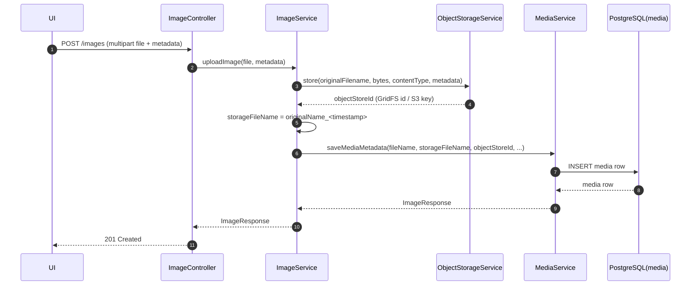
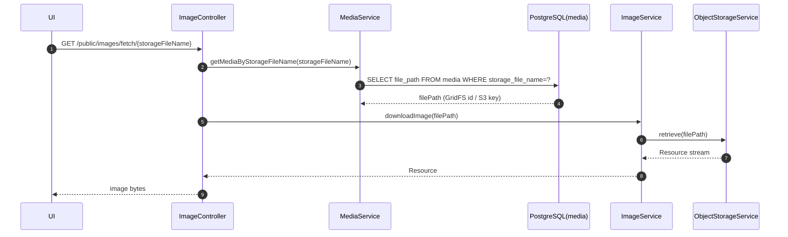
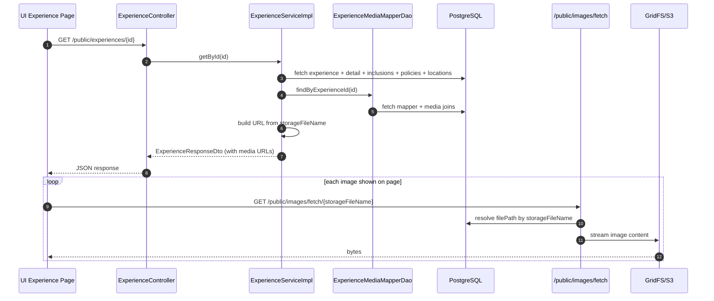
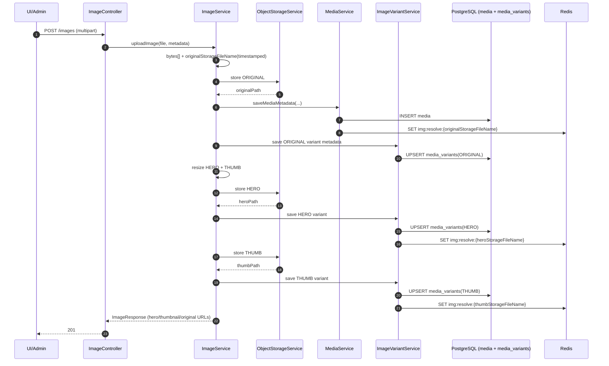
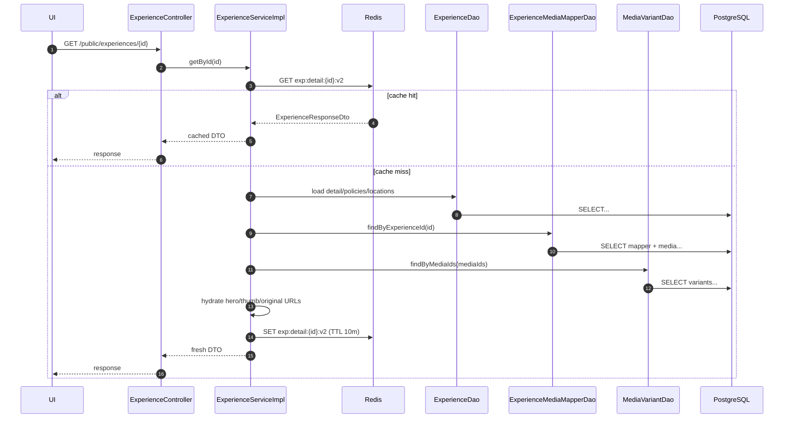
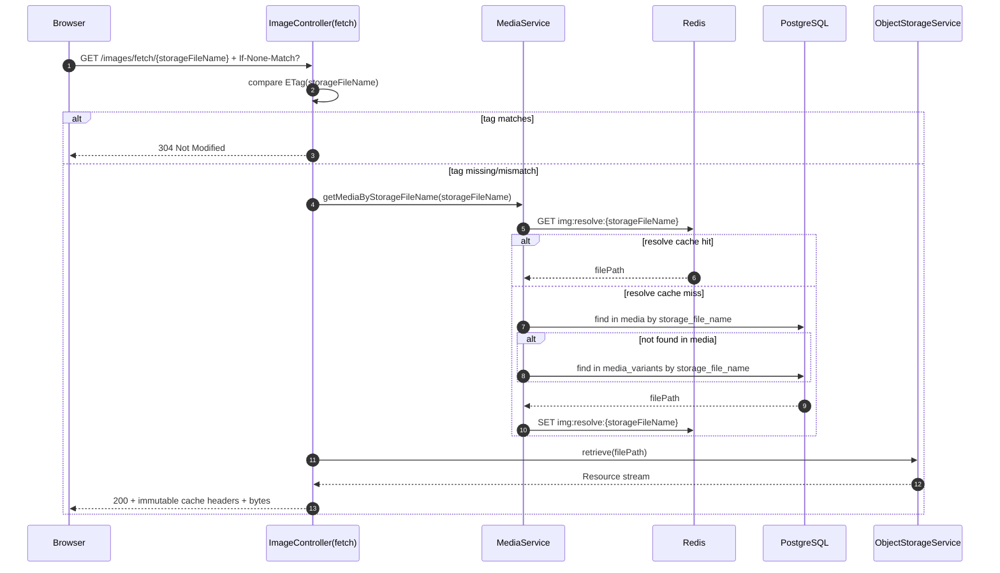
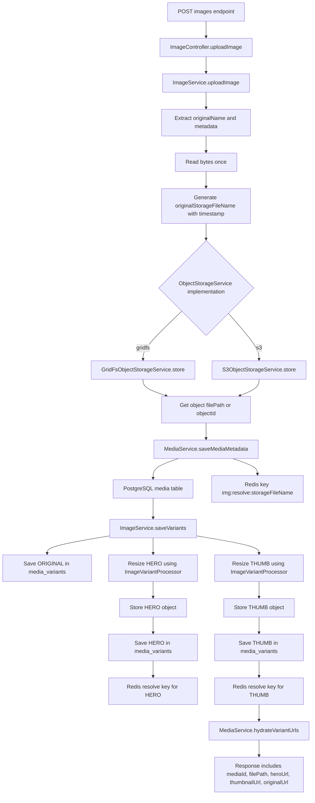
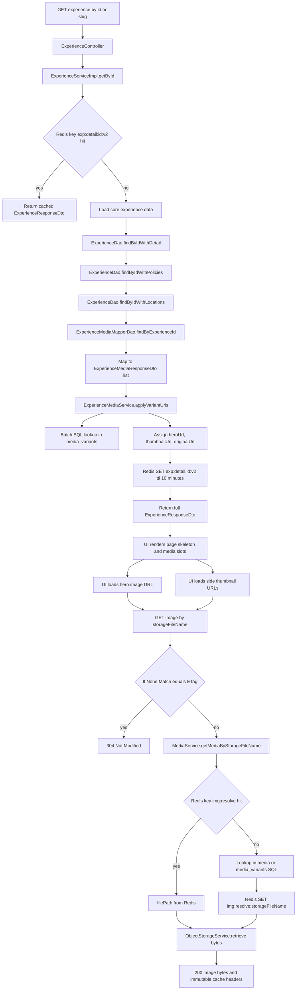
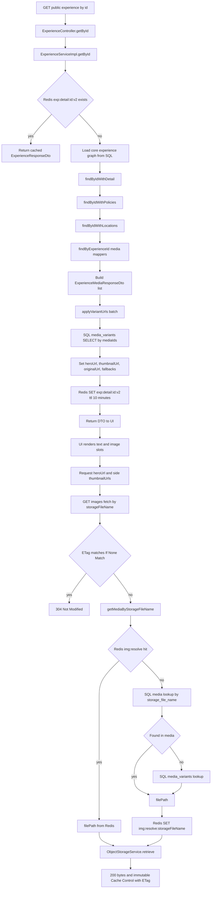

# Image Service Flow and Optimization Plan (No CDN)

> Service context: `moment_forever_core` + `moment_forever_object_store`  
> Runtime object store: `GridFS` (default) or `S3` based on `object.store.provider`  
> Current cache-busting strategy: `storageFileName = originalName_<timestamp>`

---

## 1. Why this document

This document captures:

1. **Current behavior** of image upload, metadata persistence, experience-media attachment, and experience detail reads.
2. **Exact points of latency** for your current UI (large hero image + thumbnail strip).
3. **Massive optimization plan** for local and production environments where **no Akamai/CDN** is used.
4. A **direct comparison** between current and target architecture.

---

## 2. Current architecture (as implemented now)

## 2.1 Current upload path (binary + metadata split)

### What happens now

1. `POST /public/images` or `POST /admin/images`
2. `ImageService.uploadImage(...)` stores binary via `ObjectStorageService.store(...)`
   - GridFS: returns ObjectId string
   - S3: returns generated object key
3. Service creates `newFileName` using timestamp (`FileExtension.generateTimestampName`)
4. `MediaService.saveMediaMetadata(...)` inserts SQL `media` record:
   - `file_name` = original filename
   - `storage_file_name` = timestamped filename (cache-bust path token)
   - `file_path` = object store id/key
   - mime/type/size fields
5. Response returns media DTO with fetch URL built from `storageFileName`.

### Diagram — Current upload flow

---

## 2.2 Current image retrieval path

### What happens now

1. UI calls `/public/images/fetch/{storageFileName}`
2. `MediaService` resolves `storageFileName -> filePath` from SQL.
3. `ImageService.downloadImage(filePath)` loads from object store (GridFS/S3).
4. Resource is streamed back to client.

### Diagram — Current fetch flow

---

## 2.3 Current experience + images behavior

### What happens now

1. UI loads one experience by id or slug (`/public/experiences/{id}` or `/slug/{slug}`).
2. Service returns experience detail + mapped media list.
3. Each media item carries URL(s) built from `storageFileName`.
4. UI then triggers image fetch requests for:
   - primary hero image
   - side thumbnails / gallery images
5. Each image call resolves SQL `storageFileName` then streams actual bytes from GridFS/S3.

### Diagram — Current experience page load

---

## 2.4 Current cache busting (important and correct)

Current behavior is:

- Every upload gets a new `storageFileName` by appending timestamp.
- URLs embed this name (`/public/images/fetch/{storageFileName}`).
- If content changes and image is re-uploaded, URL changes automatically.
- Browser sees a new URL and does not reuse stale cached content.

### Why this is already strong

- Cache invalidation complexity is pushed to URL versioning.
- You can safely send long cache headers for immutable timestamped URLs later.
- No need for manual purge calls in no-CDN architecture.

---

## 3. Where render time is spent for your current UI

For your layout (one large hero + multiple thumbs), main delays are:

1. **Byte weight** (full-size images being used where thumbnails are expected).
2. **Multiple image HTTP calls** per experience page.
3. **Object store round trips** for each fetch.
4. Repeated SQL lookup `storageFileName -> filePath` on every image fetch.

The expensive part is not string URL construction. It is binary delivery path.

---

## 4. Optimization goals (local + production, no CDN)

## 4.1 Primary goals

1. Minimize **time-to-first-visual** for hero image.
2. Minimize total bytes for gallery strip.
3. Reduce backend work per image fetch.
4. Keep strict correctness with current timestamp-based cache busting.

## 4.2 Constraints

- Keep existing API compatibility as much as possible.
- No Akamai/CDN dependency in production.
- Continue supporting runtime object store selection (`gridfs`/`s3`).

---

## 5. Massive optimization plan (recommended)

## Phase 0 — Baseline and guardrails

1. Capture baseline metrics:
   - p50/p95 response for `/public/experiences/{id}`
   - p50/p95 response for `/public/images/fetch/{storageFileName}`
   - average hero image bytes
   - average thumbnails total bytes/page
2. Add explicit performance targets:
   - experience detail API p95 < 150ms (app layer, local network conditions)
   - hero image first render bytes <= 300KB target
   - each thumbnail <= 60KB target

---

## Phase 1 — Real image variants (highest impact)

### Problem this fixes

Today `thumbnailUrl` effectively points to same heavy image path.  
UI pays full-byte cost even for small preview surfaces.

### Design

Generate and persist **3 variants** per uploaded image:

1. `ORIGINAL` — full quality (for full-screen/lightbox)
2. `HERO` — medium optimized (for main display block)
3. `THUMB` — small optimized (for strip/list cards)

### Storage model (recommended)

Introduce `media_variants` table instead of duplicating URLs in mapper:

| Column | Purpose |
|---|---|
| `id` | PK |
| `media_id` | FK to `media.id` |
| `variant_type` | `ORIGINAL/HERO/THUMB` |
| `storage_file_name` | timestamped per variant |
| `file_path` | object store id/key for this variant |
| `mime_type` | actual mime type |
| `file_size_bytes` | monitoring + tuning |
| `width`,`height` | optional |
| `created_on` | audit |

Unique key: `(media_id, variant_type)`.

### Why variant-level `storage_file_name` matters

- Preserves your current cache-busting behavior for each variant independently.
- If hero variant regenerated, only hero URL changes.
- Browser can cache thumbnails and hero separately.

### API response shape (experience detail)

For each media item return:

- `heroUrl`
- `thumbnailUrl`
- `originalUrl` (optional; only for "View full")

UI rendering policy:

- Big image uses `heroUrl`
- Side strip uses `thumbnailUrl`
- Full-screen modal uses `originalUrl`

---

## Phase 2 — Redis for metadata and mapper payloads

Use Redis where it helps most: **JSON metadata**, not binaries.

## 2.1 Cache what

1. Experience detail payload with media variant URLs:
   - key: `exp:detail:{id}:v2`
2. Storage resolution cache for image fetch route:
   - key: `img:resolve:{storageFileName}` -> `filePath + contentType + size`

## 2.2 Cache behavior

- TTL for experience detail key: 5–15 minutes (start with 10).
- TTL for image resolution key: 1–6 hours (start with 2).
- Write-through invalidation on:
  - media attach/detach/update
  - media delete/deactivate
  - experience update affecting gallery content

## 2.3 Why this helps without CDN

- `/public/experiences/{id}` avoids repeated SQL + mapper work.
- `/fetch/{storageFileName}` avoids SQL lookup for every image request.
- still streams bytes from GridFS/S3, but request setup becomes faster.

---

## Phase 3 — HTTP cache semantics for no-CDN production

Since URLs are timestamp-versioned, mark responses as aggressively cacheable:

- `Cache-Control: public, max-age=31536000, immutable`
- `ETag` (stable per variant object)
- `Last-Modified`
- Honor `If-None-Match` / `If-Modified-Since` with `304 Not Modified`

### Why safe

Timestamped filename means object URL is immutable in practice.
New upload = new URL. Old URL can remain cached forever.

---

## Phase 4 — API and query shaping

1. Keep experience detail API returning media list with variant URLs.
2. Ensure SQL query for media list projects only required columns for detail page.
3. Keep list endpoints lightweight (do not include full gallery unless needed).

---

## Phase 5 — Upload pipeline strategy

Two implementation modes:

1. **Synchronous variant generation** (recommended first)
   - simpler consistency
   - upload response includes ready URLs
   - slightly slower upload request (acceptable for admin workflows)
2. **Asynchronous variant generation** (future scale mode)
   - fast upload response
   - queue job creates variants
   - UI handles temporary placeholder state

Start sync, move async only when upload throughput demands it.

---

## 6. Local vs production (without CDN)

## 6.1 Local profile recommendations

- Keep same variant logic, lower quality settings for speed.
- Redis enabled with short TTL to test invalidation.
- GridFS default provider.
- Keep image size caps strict to protect developer machines.

## 6.2 Production recommendations (no CDN)

1. Prefer S3 provider for object storage scalability (if available in env).
2. Redis mandatory for metadata caching and fetch-resolution cache.
3. Strong HTTP cache headers on image fetch endpoint.
4. Use variant-specific object sizes aggressively.
5. Set connection pool and timeouts tuned for burst image traffic.

Even without CDN, browser cache + immutable URLs + smaller variants deliver large gains.

---

## 7. Invalidation matrix (must be explicit)

| Event | Invalidate keys |
|---|---|
| Upload media | `exp:detail:*` only if immediately attached; otherwise none |
| Attach media to experience | `exp:detail:{experienceId}:v2` |
| Update attachment (primary/order/active/alt) | `exp:detail:{experienceId}:v2` |
| Detach media | `exp:detail:{experienceId}:v2` |
| Delete media | all affected experience detail keys + `img:resolve:{storageFileName}` |
| Regenerate variant | `exp:detail:{experienceId}:v2`, `img:resolve:{oldStorageFileName}` |

---

## 8. Current vs target comparison

| Area | Current | Target plan |
|---|---|---|
| Hero/thumbnail bytes | Often full-size asset reused | Dedicated `HERO` + `THUMB` variants |
| Cache busting | Timestamped `storageFileName` | Same strategy, extended per variant |
| Experience detail payload | Includes media URLs | Includes variant-specific URLs |
| Image fetch setup | SQL lookup each time | Redis resolve cache first, SQL fallback |
| Binary delivery | GridFS/S3 only | GridFS/S3 + browser immutable caching |
| URL persistence in mapper | Not stored | Still not needed (avoid drift/duplication) |
| No-CDN readiness | Moderate | High (headers + variants + Redis) |

---

## 9. Why mapper-level stored URL is not the best optimization

Storing full URL in `experience_media_mappers` looks attractive but has weak ROI:

1. It does not reduce image byte transfer.
2. URL format/domain changes cause stale persisted data.
3. Same media attached to many experiences duplicates URL data.
4. Current join already fetches mapper+media efficiently.

Best ROI remains: **variant generation + Redis metadata caching + immutable browser caching**.

---

## 10. Rollout plan (execution order)

1. **Schema**: add `media_variants` table + JPA model + DAO.
2. **Upload path**: generate/store `ORIGINAL/HERO/THUMB` and persist variant rows.
3. **DTO updates**: expose variant URLs on experience media response.
4. **Service wiring**: map variant URLs in experience detail flow.
5. **Redis caching**: add read-through for experience detail + image resolve keys.
6. **HTTP caching headers**: enable immutable/etag/304 in image fetch endpoint.
7. **UI consumption update**:
   - hero uses `heroUrl`
   - strip uses `thumbnailUrl`
   - full modal uses `originalUrl`
8. **Measure and tune** against Phase 0 baselines.

---

## 11. Success criteria

Implementation is successful when:

1. Experience detail endpoint latency is stable under load.
2. First visual render time drops significantly on image-heavy experiences.
3. Thumbnail strip no longer downloads full-resolution assets.
4. Browser repeat visits fetch fewer bytes due to immutable cache hits.
5. Cache-busting still works automatically on re-upload via timestamped names.

---

## 12. Implementation status (current codebase)

The following parts of this plan are now implemented in backend code:

1. **Redis fast-path for experience detail payload**
   - key: `exp:detail:{experienceId}:v2`
2. **Redis fast-path for storage resolution**
   - key: `img:resolve:{storageFileName}`
3. **Synchronous image variants on upload**
   - `ORIGINAL`, `HERO`, `THUMB` variants persisted in `media_variants`
4. **Variant-aware URL response wiring**
   - Experience/media responses now hydrate hero/thumbnail/original URL fields from variants
5. **Immutable cache headers on fetch endpoints**
   - `ETag` by `storageFileName`
   - long-lived immutable cache control

---

## 13. Implemented flow (revision-ready reference)

This section documents the **actual implemented behavior** after the optimization changes, so code reviews and future revisions can refer to one place.

## 13.1 Upload flow (synchronous variant generation)

### Entry points

- `POST /public/images`
- `POST /admin/images`

### Implemented steps

1. Controller calls `ImageService.uploadImage(file, metadata)`.
2. Service reads source bytes once.
3. Service generates timestamped storage name for original:
   - `originalStorageFileName = originalName_<timestamp>.<ext>`
4. Original binary is stored via `ObjectStorageService.store(...)`.
5. SQL `media` row is inserted via `MediaService.saveMediaMetadata(...)`.
6. Variant records are persisted in `media_variants`:
   - `ORIGINAL` variant uses original storage key/id
   - `HERO` variant generated by resize (max width ~1280), stored as new object
   - `THUMB` variant generated by resize (max width ~320), stored as new object
7. `img:resolve:{storageFileName}` Redis entries are warmed for original and variants.
8. Response DTO is hydrated with variant URLs:
   - hero URL (`url`, `mediaUrl`)
   - thumbnail URL (`thumbnailUrl`)
   - original URL (`originalUrl`)

### Diagram — implemented upload flow

---

## 13.2 Experience detail load flow (with Redis fast-path)

### Entry points

- `GET /public/experiences/{id}`
- `GET /public/experiences/slug/{slug}` (slug resolves to id, then same path)

### Implemented steps

1. `ExperienceServiceImpl.getById(id)` checks Redis:
   - `GET exp:detail:{id}:v2`
2. On cache hit:
   - return cached `ExperienceResponseDto` immediately.
3. On cache miss:
   - load experience/detail/policies/locations from SQL DAOs
   - load media mappers (`experience_media_mappers` + media join)
   - apply variant URLs in `ExperienceMediaService.applyVariantUrls(...)`
   - set result in Redis key `exp:detail:{id}:v2` (10-minute TTL)
   - return DTO to client.

### Diagram — implemented experience detail flow

---

## 13.3 Image fetch flow (immutable URL + resolve cache)

### Entry points

- `GET /public/images/fetch/{storageFileName}`
- `GET /admin/images/fetch/{storageFileName}`

### Implemented steps

1. Endpoint computes:
   - `ETag = "{storageFileName}"`
   - `Cache-Control: public, max-age=365d, immutable`
2. If request has matching `If-None-Match`:
   - return `304 Not Modified`.
3. Else resolve file path:
   - `GET img:resolve:{storageFileName}`
   - if miss, SQL lookup in `media`, then fallback `media_variants`, then cache result
4. Stream binary via `ObjectStorageService.retrieve(filePath)`.

### Diagram — implemented fetch flow

---

## 13.4 Invalidation flow (implemented)

### Experience detail cache key

- `exp:detail:{experienceId}:v2`

Evicted on:

1. experience update/delete/toggle active/toggle featured/upsert detail
2. media attach/update/detach/toggle attachment active
3. media update/delete for every linked experience (resolved via `findExperienceIdsByMediaId`)

### Image resolve cache key

- `img:resolve:{storageFileName}`

Evicted/updated on:

1. media save/update/delete
2. variant upsert/delete

---

## 13.5 URL field behavior after optimization

### For `ImageResponse`

- `mediaUrl` / `url` => hero variant URL (fallback to original)
- `thumbnailUrl` => thumb variant URL (fallback hero/original)
- `originalUrl` => original variant URL

### For `ExperienceMediaResponseDto`

- `url` => hero variant URL
- `heroUrl` => hero variant URL
- `thumbnailUrl` => thumb variant URL
- `originalUrl` => original variant URL

### Cache busting behavior

Still fully based on timestamped storage file names:

- each stored object (original/hero/thumb) has unique timestamped `storageFileName`
- URL path changes automatically when object is regenerated/reuploaded
- immutable cache headers are safe because object URLs are versioned by name

---

## 14. Code-aware diagrams (for quick revision)

Below are two diagrams in the same style you asked for: high-level enough to scan quickly, but with the **important method-level logic** so reviewers can map flow to code.

## 14.1 Upload image flow (controller -> storage decision -> SQL -> variants)

### Key code checkpoints

1. `ImageController.uploadImage(...)`  
2. `ImageService.uploadImage(...)`
   - reads bytes once
   - creates `originalStorageFileName = originalName_<timestamp>`
   - calls `ObjectStorageService.store(...)`
3. `ObjectStorageService` runtime implementation decision:
   - `GridFsObjectStorageService` (default)
   - `S3ObjectStorageService` when `object.store.provider=s3`
4. `MediaService.saveMediaMetadata(...)`
   - inserts SQL `media` row (`fileName`, `storageFileName`, `filePath`, mime/size)
   - warms `img:resolve:{storageFileName}` in Redis
5. `ImageService.saveVariants(...)` + `ImageVariantProcessor.resize(...)`
   - persists `media_variants` rows: `ORIGINAL`, `HERO`, `THUMB`
6. `MediaService.hydrateVariantUrls(...)`
   - sets `hero`, `thumbnail`, `original` URLs in response

### Diagram — upload (code-aware)

---

## 14.2 Get experience with images flow (hero + thumbnails + side gallery)

### Key code checkpoints

1. `ExperienceController.getById(...)` or `getBySlug(...)`
2. `ExperienceServiceImpl.getById(...)`
   - checks Redis: `exp:detail:{id}:v2`
3. On cache miss:
   - `ExperienceDao.findByIdWithDetail(...)`
   - `ExperienceDao.findByIdWithPolicies(...)`
   - `ExperienceDao.findByIdWithLocations(...)`
   - `ExperienceMediaMapperDao.findByExperienceId(...)`
4. `ExperienceMediaService.applyVariantUrls(...)`
   - batch loads variants by media ids
   - maps URLs:
     - hero image -> `heroUrl` / `url`
     - side strip images -> `thumbnailUrl`
     - full image -> `originalUrl`
5. stores final DTO in Redis and returns to UI
6. UI calls `/images/fetch/{storageFileName}` for hero + side images
   - fetch endpoint uses ETag/immutable headers
   - file path resolved via Redis key `img:resolve:{storageFileName}` first
   - binary streamed from GridFS/S3

### Diagram — experience + images (code-aware)

### UI mapping summary

- **Main big image**: use `heroUrl` (or `url`) from experience response.
- **Left/side strip images**: use `thumbnailUrl`.
- **View full / lightbox**: use `originalUrl`.

---

## 15. Deep-dive mixed flow (diagram + narrative)

This section adds more depth for reviewers who want to understand **how the code behaves at each branch**, not only the happy-path arrows.

## 15.1 Deep upload flow (with persistence + variant + cache details)

### A) Narrative flow (what happens in code)

1. **Request intake**
   - API receives multipart file at `ImageController` (`/public/images` or `/admin/images`).
   - Controller forwards file + metadata map to `ImageService.uploadImage(...)`.

2. **Source normalization in `ImageService`**
   - File bytes are loaded once (`file.getBytes()`), so downstream variant generation does not re-read the stream.
   - Original name is taken from `file.getOriginalFilename()`.
   - Cache-busting storage name is generated:
     - `originalStorageFileName = baseName + "_" + System.currentTimeMillis() + ext`.

3. **Object store write (runtime provider decision)**
   - `ObjectStorageService.store(...)` is called with `originalStorageFileName`.
   - Runtime implementation:
     - GridFS (`GridFsObjectStorageService`) by default.
     - S3 (`S3ObjectStorageService`) when `object.store.provider=s3`.
   - Output: `filePath` (GridFS object id or S3 key).

4. **SQL metadata write**
   - `MediaService.saveMediaMetadata(...)` inserts into `media`:
     - `file_name` = user/original name
     - `storage_file_name` = timestamped original name
     - `file_path` = object store id/key
     - `mime_type`, `file_size_bytes`, `media_type`.
   - Redis warm-up:
     - `img:resolve:{storageFileName}` -> `filePath`.

5. **Variant generation and storage**
   - `ImageService.saveVariants(...)` persists `ORIGINAL` into `media_variants` (points to original object).
   - If content type is image:
     - decode using `ImageVariantProcessor.decode(...)`
     - create `HERO` (~1280 max width)
     - create `THUMB` (~320 max width)
     - store each as independent object in object store
     - upsert each variant row in `media_variants`
     - warm Redis resolve keys for hero/thumb storage names.

6. **Response URL hydration**
   - `MediaService.hydrateVariantUrls(...)` reads variants and sets:
     - `mediaUrl` / `url` = hero (fallback original)
     - `thumbnailUrl` = thumb (fallback hero/original)
     - `originalUrl` = original.
   - Final DTO returned to controller and then client.

### B) Deep diagram (with data mutations)

### C) Failure behavior to note

1. If object-store original write fails -> upload fails (no SQL metadata row).
2. If SQL metadata save fails -> upload fails; original binary may already exist (orphan cleanup can be added later).
3. If hero/thumb generation fails after original save:
   - original still exists and is usable;
   - URL fallbacks still allow rendering via original.

---

## 15.2 Deep experience-with-images flow (hero + side thumbnails + fetch bytes)

### A) Narrative flow (what happens in code)

1. **Entry and cache short-circuit**
   - `GET /public/experiences/{id}` -> `ExperienceServiceImpl.getById(id)`.
   - Redis lookup: `exp:detail:{id}:v2`.
   - Hit => immediate return of full DTO (includes media with hero/thumb/original URLs).

2. **Cache miss SQL assembly**
   - Experience core graph is assembled in split queries:
     - `findByIdWithDetail(...)`
     - `findByIdWithPolicies(...)`
     - `findByIdWithLocations(...)`
   - Media mappings are loaded by:
     - `ExperienceMediaMapperDao.findByExperienceId(id)` (mapper + media join).

3. **Variant URL hydration for media list**
   - `ExperienceMediaService.applyVariantUrls(...)`:
     - collects media ids from mapper DTO list
     - batch loads variants from `media_variants`
     - applies URL mapping:
       - hero to `url` + `heroUrl`
       - thumb to `thumbnailUrl`
       - original to `originalUrl`
     - fallback chain:
       - hero missing -> original
       - thumb missing -> hero/original.

4. **Response caching**
   - Fully assembled DTO is stored:
     - `SET exp:detail:{id}:v2` (TTL 10 min).
   - Returned to UI.

5. **UI image byte requests**
   - UI uses:
     - `heroUrl` for big image
     - `thumbnailUrl` for side strip
   - Each request hits `/images/fetch/{storageFileName}`:
     - if ETag matches -> `304` no bytes
     - else resolve `storageFileName`:
       - Redis `img:resolve:*` first
       - fallback SQL `media`, then `media_variants`
     - stream bytes from object store.

### B) Deep diagram (metadata path + byte path)

### C) Why this is fast enough in practice

1. **Metadata path is amortized by Redis detail cache** (`exp:detail:*`).
2. **Storage-name resolution is amortized by Redis resolve cache** (`img:resolve:*`).
3. **Network bytes are reduced** because UI can use thumb/hero instead of original.
4. **Browser re-renders are cheap** because immutable ETag-enabled URL responses return 304 when unchanged.

### D) Mutation points that invalidate cached detail

When any of these operations run, `exp:detail:{id}:v2` is evicted:

- experience update/delete/toggle/upsert detail
- media attach/update/detach/toggle attachment
- media update/delete (for all linked experiences via `findExperienceIdsByMediaId`)

This keeps experience page payload consistent with SQL + variant state.
