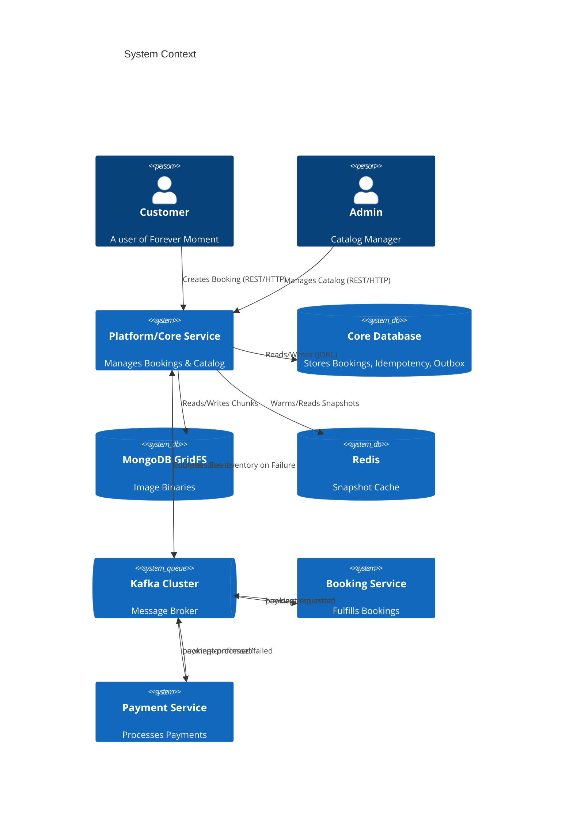
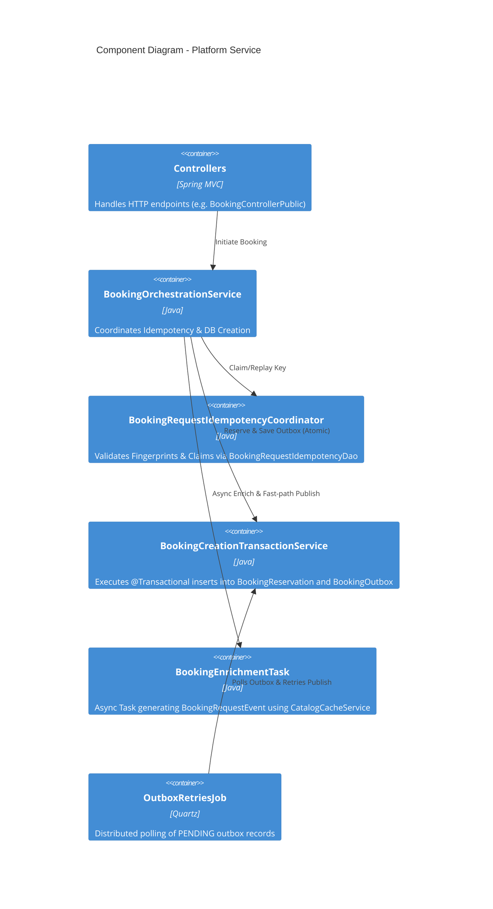
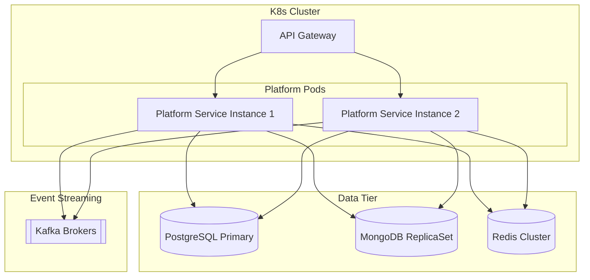
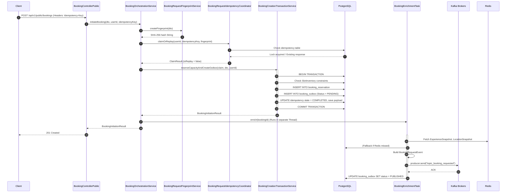

# Forever Moment Platform/Core Service - Volume 1: Business and Architecture Overview

## SECTION 1 - BUSINESS OVERVIEW

### 1. Purpose of Platform/Core Service
The Platform (Core) Microservice (`moment-forever-platform`) serves as the foundational catalog, inventory, identity, and booking initiation engine for the entire Forever Moment architecture. It acts as the single source of truth for the platform's core domain entities (Experiences, Categories, Locations, Time Slots, Add-ons) and initiates the first half of the distributed booking saga. 

In a distributed environment, domain boundaries dictate that this service owns the rules of engagement for what can be booked, where, and when, but defers the realization of those bookings to downstream services.

### 2. Business Responsibilities
**Responsibilities OWNED by Platform Service:**
- **Catalog Management:** Full CRUD lifecycle for `Category`, `SubCategory`, `Experience`, `Location`, `TimeSlot`, and `Addon`.
- **Media and Asset Management:** Upload, storage, and retrieval of `Media` and `ExperienceMedia` using MongoDB GridFS.
- **Inventory & Capacity Management:** Enforcing constraints via `SlotInventory`, tracking `max_capacity` and `booked_count` at the slot mapper level per date.
- **Booking Initiation:** The initial acceptance of a booking request, validation of parameters, and the reservation of capacity.
- **Reliable Event Publication:** Ensuring that booking events (`BookingCreatedEvent`, `BookingFailedEvent`) are safely durably persisted to an Outbox before hitting Kafka.
- **Request Idempotency:** Guaranteeing that duplicate user requests (e.g., impatient clicks, network retries) do not result in duplicate billing or duplicate inventory decrements.
- **Transaction Boundaries:** Synchronizing PostgreSQL ACID transactions (Inventory decrement + Outbox insertion).
- **Snapshot Caching:** Maintaining Redis-based read-models of catalog items to enrich booking events asynchronously without impacting the relational database.

**Responsibilities NOT OWNED by Platform Service:**
- **Booking Lifecycle and Fulfillment:** The actual `Booking` record lifecycle beyond initiation. The `Booking Service` takes over once the `booking-requested` event is published.
- **Payment Processing:** Fully delegated to the `Payment Service`. The Platform service is entirely agnostic to credit cards, gateways, or monetary authorization statuses.
- **Customer Notifications:** SMS, Email, and Push Notifications are handled by a downstream Notification Service triggered by events on Kafka.

### 3. What Business Problem It Solves
Distributed booking systems face a classic problem: **The Dual-Write Problem and Network Unreliability.**
When a user clicks "Book", the system must decrement available inventory in the database and notify the Payment service via Kafka to charge the user. If the database commits but Kafka is down, the inventory is lost forever, but the user is never charged (revenue loss). If Kafka receives the message but the database rolls back, the user is charged for a booking that doesn't exist (critical customer trust failure).

Furthermore, if a user's mobile app loses network connection precisely while waiting for the HTTP response, the app will retry. Without strict idempotency, that retry would initiate a completely separate booking saga, double-charging the user and double-deducting inventory. 

The Platform Service solves this through a meticulously crafted combination of Request Idempotency, Transactional Outbox, and Distributed Quartz Schedulers.

### 4. Why the Service Exists
The service exists to isolate the highly transactional, high-concurrency domains of Catalog mapping and Inventory control from the asynchronous, integration-heavy domains of Payments and Partner communications.

### 5. Boundaries of the Service
The Platform service receives synchronous HTTPS traffic via the API Gateway (port 8081, context `/platform`).
It makes **zero synchronous HTTP calls** to other microservices. Its output boundary is exclusively Kafka topics (`topic_booking_requested`), making it highly resilient to downstream outages.

### 6. Systems Interacting with this Service
- **API Gateway:** Routes `POST /api/v1/public/bookings`, strips internal headers, and injects `X-User-Id` and `X-User-Roles`.
- **Booking Service (Consumer):** Listens to `booking-requested` events.
- **Kafka Cluster:** The central nervous system for events.
- **PostgreSQL Database:** The persistent source of truth for relationships and ACID transactions.
- **MongoDB GridFS:** The Binary Large Object (BLOB) store for images.
- **Redis:** The transient distributed cache for fast read-paths during enrichment.
- **Consul:** Service discovery registry.

---

## SECTION 2 - ARCHITECTURE OVERVIEW

### 1. System Context Diagram


### 2. Component Diagram


### 3. Layer Diagram
The application follows a strict Domain-Driven Design (DDD) layered architecture:

- **Web / Presentation Layer (Controllers):** `com.forvmom.core.controller.*` contains controllers segmented by user role (`admin`, `pub`, `user`). Examples: `BookingControllerPublic`, `ExperienceControllerAdmin`.
- **Orchestration Layer (Services):** `com.forvmom.core.services.*` contains business orchestrators like `BookingOrchestrationService` which bridge multiple domains.
- **Domain Layer:** Contains core business logic. e.g., `BookingRequestFingerprintService` generates SHA-256 hashes of incoming requests to enforce immutability.
- **Transaction/Persistence Service Layer:** `BookingCreationTransactionService` and `BookingOutboxStateService` encapsulate Spring `@Transactional` boundaries. This separation prevents "self-invocation" proxies from bypassing transaction interceptors.
- **Repository / DAO Layer:** `com.forvmom.data.dao.*` such as `BookingOutboxDaoImpl` handle direct JPA/Hibernate interactions.
- **Messaging Layer:** `BookingEventProducer` (wraps KafkaTemplate) and `BookingFailedConsumer` (wraps @KafkaListener).
- **Background Schedulers:** Quartz jobs (`OutboxRetriesJob`, `OutboxCleanupJob`) residing in `com.forvmom.core.scheduler`.

**How a Request Travels:**
HTTP Request -> Web Filter (Security) -> Controller -> Orchestration Service -> Domain Validation (Idempotency) -> Transaction Service -> DAO -> Database.
Post-commit: Orchestration Service -> Async Enrichment -> Redis -> Event Producer -> Kafka.

### 4. Deployment Diagram


---

## SECTION 3 - COMPLETE BOOKING REQUEST FLOW

The Booking initiation flow is the most complex execution path in the application.



**Detailed Step-by-Step Analysis:**
1. **Controller mapping:** Request hits `BookingControllerPublic`. The `Idempotency-Key` header is strictly required. The `X-User-Id` is extracted from the gateway header.
2. **Fingerprinting:** `BookingRequestFingerprintService` serializes the DTO into a canonical JSON format and hashes it using SHA-256. *Why?* To prevent a client from reusing the same Idempotency-Key for a completely different payload.
3. **Atomic Claim:** `BookingRequestIdempotencyCoordinator` executes a database-level lock. If the key already exists and is `IN_PROGRESS`, it throws a 423 Locked. If it's `COMPLETED` and fingerprints match, it returns the previously cached response payload.
4. **Transaction Boundary:** `reserveCapacityAndCreateOutbox` in `BookingCreationTransactionService` starts a Postgres transaction. 
   - It validates `SlotInventory.booked_count` against `max_capacity`.
   - It increments the `booked_count`.
   - It persists a `BookingReservation`.
   - It persists a `BookingOutbox` record containing the exact payload that must be sent to Kafka.
5. **Commit:** The transaction is committed. At this exact microsecond, the booking is safely stored.
6. **Async Enrichment:** `BookingEnrichmentTask.enrich()` is called. This runs asynchronously. It looks up human-readable names and prices from `CatalogCacheService` (Redis) to pack into a fat event.
7. **Kafka Publish:** The event is sent to Kafka. Upon acknowledgment, the outbox record is marked `PUBLISHED` (or `COMPLETED`).
8. **Client Response:** The orchestration thread does not wait for Kafka. It returns HTTP 201 Created immediately after the DB commit.

---

## SECTION 4 - API DOCUMENTATION

### 1. Booking Initiation Endpoint
- **URL:** `POST /api/v1/public/bookings`
- **Purpose:** Safely initiates a booking, reserving inventory and queueing the event.
- **Headers:** 
  - `Idempotency-Key` (String, UUID format mandatory) - Client generated.
  - `X-User-Id` (Long) - Injected by Gateway.
- **Request Payload:** `BookingRequestDto`
  ```json
  {
    "experienceId": 105,
    "timeSlotMapperId": 5002,
    "bookingDate": "2026-09-15",
    "paxCount": 2,
    "addons": [
      { "addonMapperId": 302, "quantity": 1 }
    ]
  }
  ```
- **Response Payload:** `BookingInitiationResult`
  ```json
  {
    "bookingReferenceId": "bk_8f92a1b9",
    "status": "INITIATED",
    "reservationTime": "2026-08-24T22:30:00Z"
  }
  ```
- **Validation Rules:**
  - `experienceId` and `timeSlotMapperId` must exist and be active.
  - `bookingDate` must fall within allowed schedules.
  - `paxCount` must be > 0 and <= available capacity in `SlotInventory`.
- **Success Scenarios:**
  - `201 Created`: First time this idempotency key is seen.
  - `200 OK`: Idempotency key was seen previously, and the transaction succeeded. The exact same `BookingInitiationResult` is returned from the cache.
- **Failure Scenarios:**
  - `400 Bad Request`: Validation failure on the DTO.
  - `404 Not Found`: Catalog items don't exist.
  - `409 Conflict`: 
    - Inventory is exhausted (Capacity exceeded).
    - Idempotency key exists, but the fingerprint of the payload is different (Client attempted to cheat).
  - `423 Locked`: A concurrent request with the exact same Idempotency key is currently executing the DB transaction. Client should poll/retry.
  - `500 Internal Server Error`: Database constraint violations or connection drops.

### 2. Catalog Browse Endpoints (Public)
- **URL:** `GET /api/v1/public/experiences/{slug}`
- **Purpose:** Fetches full experience details for customer display.
- **Response:** Complex nested JSON containing Locations, TimeSlots, and Addons.
- **Failure:** 404 if inactive or deleted.

### 3. Admin Inventory Management Endpoints
- **URL:** `POST /api/v1/admin/inventory/override`
- **Purpose:** Allows staff to manually adjust `max_capacity` for a specific date and time slot.
- **Headers:** `X-User-Roles` must contain `ADMIN` or `SUPER_ADMIN`.
- **Business Rule:** Does not affect existing reservations. If `max_capacity` is lowered below `booked_count`, no new bookings are allowed, but existing ones are not cancelled.

*(Refer to Swagger UI at `/platform/swagger-ui.html` for exhaustive schemas of all 30+ endpoints)*
