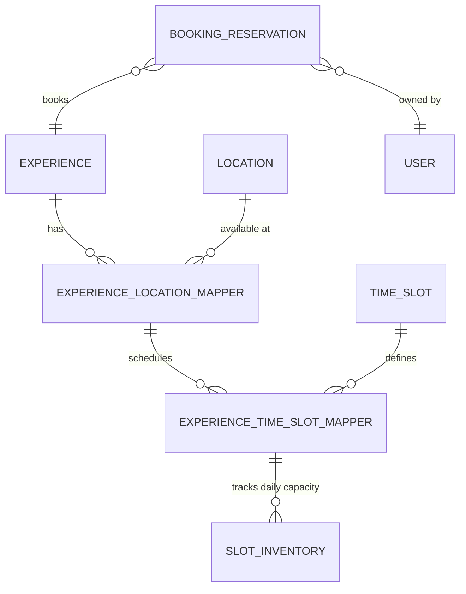
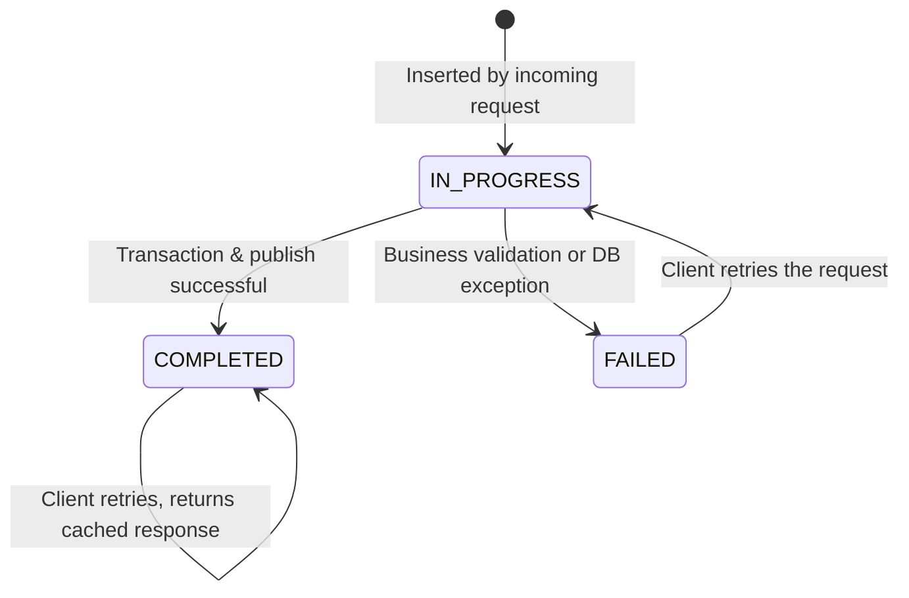
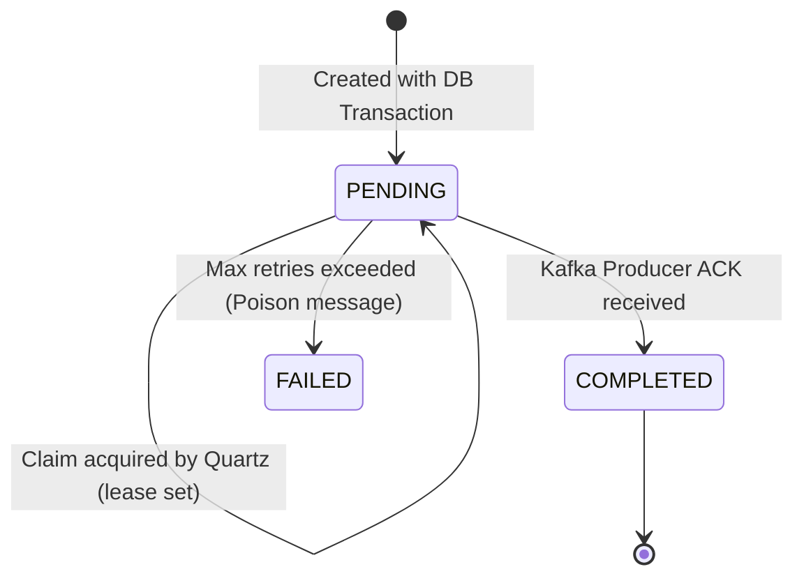

# Forever Moment Platform/Core Service - Volume 3: Data, Events, and State

## SECTION 9 - DATABASE DOCUMENTATION

The Platform service heavily leverages PostgreSQL for persistence. Below is the documentation for every critical table discovered in the entity layer (`com.forvmom.data.entity`).

### 1. Catalog & Inventory Tables

#### Table: `experience`
- **Purpose:** Represents a bookable product (e.g., "Sunset Cruise").
- **Fields:** `id` (PK, BigInt), `name` (VARCHAR), `slug` (VARCHAR, Unique), `base_price` (Decimal), `status` (VARCHAR - DRAFT, ACTIVE, INACTIVE), `created_at`, `updated_at`.
- **Relationships:** Maps to Categories, Locations, TimeSlots via mapping tables.

#### Table: `location`
- **Purpose:** Physical places where experiences happen.
- **Fields:** `id` (PK), `name` (VARCHAR), `coordinates` (JSON/VARCHAR), `pincode_id` (FK).

#### Table: `experience_location_mapper`
- **Purpose:** Many-to-Many mapping linking an Experience to a Location. Allows price overrides per location.
- **Fields:** `id` (PK), `experience_id` (FK), `location_id` (FK), `price_override` (Decimal, Nullable).
- **Constraints:** Unique index on `(experience_id, location_id)`.

#### Table: `time_slot`
- **Purpose:** Reusable time definitions (e.g., "10:00 AM - 12:00 PM").
- **Fields:** `id` (PK), `label` (VARCHAR), `start_time` (TIME), `end_time` (TIME).

#### Table: `experience_time_slot_mapper`
- **Purpose:** Maps TimeSlots to Experience-Location pairings.
- **Fields:** `id` (PK), `experience_location_id` (FK), `time_slot_id` (FK), `max_capacity` (INT), `price_override` (Decimal).
- **Constraints:** Unique index on `(experience_location_id, time_slot_id)`.

#### Table: `slot_inventory`
- **Purpose:** Tracks how many people have booked a specific slot on a specific date. This is the heart of capacity management.
- **Fields:** 
  - `id` (PK)
  - `experience_time_slot_mapper_id` (FK)
  - `inventory_date` (DATE)
  - `booked_count` (INT)
  - `version` (INT) - Used for JPA Optimistic Locking (`@Version`).
- **Constraints:** Unique index on `(experience_time_slot_mapper_id, inventory_date)`. 
- **Why constraints exist:** Without a unique index, two concurrent transactions could insert row "2026-09-15" simultaneously, leading to fragmented inventory counts. The `version` column prevents lost updates.

### 2. Operational Tables

#### Table: `booking_reservation`
- **Purpose:** Records the exact capacity reservation created during booking initiation.
- **Fields:** `id` (PK, UUID), `user_id` (FK), `experience_id` (FK), `booking_date` (DATE), `pax_count` (INT), `status` (VARCHAR).
- **Relationships:** Links the user to the experience. 

#### Table: `booking_request_idempotency`
- **Purpose:** Safeguards against duplicate requests.
- **Fields:** `idempotency_key` (PK, UUID), `fingerprint` (VARCHAR), `state` (VARCHAR), `response_payload` (JSONB), `lease_expiration` (TIMESTAMP).
- **Indexes:** Primary Key on `idempotency_key` is intrinsically an index.

#### Table: `booking_outbox`
- **Purpose:** The transactional outbox for reliable event dispatch.
- **Fields:** `id` (PK, UUID), `payload` (JSONB), `status` (VARCHAR), `owner_node` (VARCHAR), `lease_expires` (TIMESTAMP), `retry_count` (INT), `created_at`.
- **Indexes:** Index on `(status, lease_expires)` for fast Quartz polling.

### Entity Relationship (ER) Diagram

---

## SECTION 10 - EVENT DOCUMENTATION

### 1. `BookingRequestEvent` (Produced)
- **Topic:** `topic_booking_requested`
- **Producer:** Platform Service (via Outbox/Enrichment)
- **Consumer:** Booking Service
- **Payload:** Fat event containing User Details, Experience Name, Location Address, Pax, Total Pricing, and Add-ons.
- **Business Purpose:** Tells downstream systems that inventory has been safely reserved and a formal Booking lifecycle + Payment workflow should commence.
- **Failure Handling:** If Kafka is down, Outbox pattern + Quartz retries this infinitely (or up to a massive limit) until acknowledged.

### 2. `BookingFailedEvent` (Consumed)
- **Topic:** `topic_booking_failed`
- **Producer:** Booking Service or Payment Service
- **Consumer:** Platform Service (`BookingFailedConsumer.java`)
- **Payload:** `bookingReferenceId`, `reason` (e.g., PAYMENT_DECLINED, FRAUD_DETECTED).
- **Business Purpose:** When a booking fails downstream (e.g., card declined), the Platform Service must release the inventory it reserved.
- **Failure Handling:** The consumer acknowledges manually (`MANUAL_IMMEDIATE`). If compensation fails (e.g. database down), the message is retried 3 times locally, then pushed to a Dead Letter Topic (`core-dlt`) for manual intervention.

---

## SECTION 11 - STATE MACHINES

### 1. Request Idempotency State Machine

- **Trigger `IN_PROGRESS`:** The system locks the key. No other thread can proceed.
- **Trigger `FAILED`:** Something went wrong (e.g., max capacity exceeded). We transition to FAILED so a user *can* retry if they fix the issue.
- **Trigger `COMPLETED`:** Success. Hard termination. The payload is permanently cached.

### 2. Outbox Event State Machine

- **Why `FAILED` exists:** If a payload is permanently malformed and Kafka constantly rejects it, we must eventually give up (e.g., after 50 retries) to prevent endless CPU cycles. These trigger alerts.

---

## SECTION 12 - DESIGN PATTERNS USED

1. **Transactional Outbox Pattern**
   - **Problem Solved:** The dual-write distributed transaction problem.
   - **Why Needed:** Postgres and Kafka do not share a 2-Phase Commit (2PC) coordinator.
   - **Advantages:** Guaranteed at-least-once delivery. High reliability.
   - **Disadvantages:** Read-heavy polling overhead on the database (Quartz).

2. **Idempotency Key Pattern**
   - **Problem Solved:** Duplicate HTTP POSTs executing twice.
   - **Why Needed:** Mobile networks are flaky. API Gateway retries are aggressive.
   - **Alternative Approaches:** Synchronous distributed locks in Redis. We chose Postgres because we wanted idempotency state to share the same ACID domain as the business data.

3. **Atomic Claims (Pessimistic DB Lock) Pattern**
   - **Problem Solved:** Multiple background schedulers processing the same records.
   - **Advantages:** No need for a separate locking infrastructure like ZooKeeper or Redis Redlock. Leverages existing PostgreSQL capabilities.

4. **Fat Event Pattern (Enrichment)**
   - **Problem Solved:** Downstream services constantly querying Platform for experience details.
   - **How it works:** The `BookingEnrichmentTask` populates the event with names, prices, and locations. The Booking service stores this directly. This increases coupling on the schema but radically improves runtime availability (if Platform goes down, Booking service can still show booking details to users).

5. **Optimistic Locking (`@Version`)**
   - **Problem Solved:** `SlotInventory` race conditions.
   - **How it works:** If Thread A reads `booked_count = 5 (v1)` and Thread B reads `booked_count = 5 (v1)`. Thread A updates to `6 (v2)`. Thread B tries to update to `6 (v2)` but sees `version` is now 2 in DB. Thread B throws `ObjectOptimisticLockingFailureException`. The transaction rolls back, and Idempotency handles the retry safely.
## SECTION 12.5 - CAPACITY RESERVATION CONCURRENCY & OPTIMISTIC LOCKING

### 1. Where is the query that checks the version and makes the updates?

If you look at SlotInventoryService.java, you won't find a manual UPDATE query checking the version. Instead, the application relies on **JPA/Hibernate's Automatic Optimistic Locking**.

In the SlotInventory.java entity, the following field exists:
`java
@Version
@Column(name = "version", nullable = false)
private Long version;
`

Because of the @Version annotation, Hibernate acts as a strict concurrency guard behind the scenes. When 
eserveCapacity completes its logic and the @Transactional boundary closes, Hibernate automatically generates and executes an SQL statement that looks like this:

`sql
UPDATE slot_inventory 
SET booked_count = :new_count, version = :version + 1 
WHERE id = :id AND version = :version;
`

**How it prevents double bookings:**
1. **User A and User B** both want the very last seat.
2. Both read the same database row: ooked_count = 9, ersion = 1.
3. **User A**'s transaction flushes first: UPDATE slot_inventory SET booked_count=10, version=2 WHERE id=1 AND version=1. This updates **1 row**. User A gets the booking.
4. **User B**'s transaction attempts to flush immediately after: UPDATE slot_inventory SET booked_count=10, version=2 WHERE id=1 AND version=1. Because User A already changed the version to 2, this query updates **0 rows**.
5. Hibernate detects that 0 rows were updated and immediately throws an ObjectOptimisticLockingFailureException. User B's transaction is safely rolled back.

### 2. Why are we using a loop for max attempts (MAX_ATTEMPTS)?

When User B's transaction fails with an ObjectOptimisticLockingFailureException, simply returning a "500 Internal Server Error" to the customer is a bad user experience. 

The core issue is a microsecond race condition. By the time User B failed, the database state has stabilized. If User B just tried again, they would read the *new* state (version 2, booked_count 10), and the system could properly evaluate if capacity is *actually* exceeded.

This is exactly why BookingCreationRetryService.java exists:
`java
// Every attempt starts a new transaction in BookingCreationTransactionService.
for (int attempt = 1; attempt <= MAX_ATTEMPTS; attempt++) {
    try {
        return bookingCreationTransactionService.reserveCapacityAndCreateOutbox(
                claim, bookingRequest, userId);
    } catch (ObjectOptimisticLockingFailureException exception) {
        lastConflict = exception;
        logger.debug("Retrying booking reservation after optimistic lock conflict...");
    }
}
`

**The Loop Mechanism:**
1. The loop explicitly catches the ObjectOptimisticLockingFailureException.
2. It loops up to MAX_ATTEMPTS = 3 times.
3. On the next iteration, a **brand new transaction** begins.
4. It reads the fresh state from the database. 
5. If there are still seats left (e.g., max capacity is 20, they fought over the 10th seat), the retry succeeds! The user never notices the microscopic conflict.
6. If the seat they fought over was truly the last one, the ensureCapacity() check fails on the second loop, and the user gets a graceful, accurate CapacityExceeded business error instead of a database crash.

The loop guarantees maximum throughput for concurrent bookings while perfectly protecting capacity constraints.
